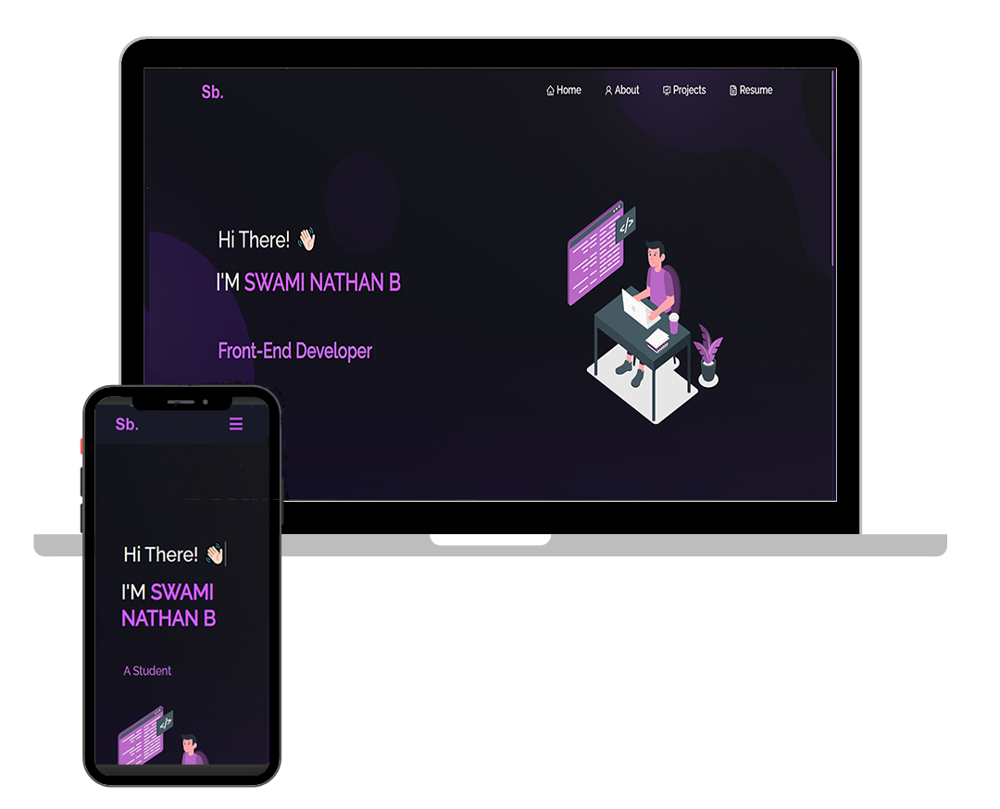

# Swami's Portfolio



Welcome to my personal portfolio! 🚀 This portfolio showcases some of my GitHub projects, my resume, and technical skills.

## Technologies Used

- React.js ⚛️
- Node.js 🚀
- Express.js ⚙️
- CSS3 🎨
- VsCode 💻
- Vercel 🌐

## Features

- **Multi-Page Layout:** The portfolio has a multi-page layout for a more organized presentation of information.
- **Styled Components:** Utilizes React-Bootstrap and custom CSS for easy customization of colors and styles.
- **Fully Responsive:** Ensures a seamless experience across various devices.

## Getting Started

To explore or run the project locally, follow the steps below:

### Prerequisites

Make sure you have [Node.js](https://nodejs.org/) and [Git](https://git-scm.com/) installed globally on your machine.

### Installation

```bash
git clone https://github.com/swami1302/Portfolio.git
cd Portfolio
npm install
```

### Running Locally

```bash
npm start
```

Open [http://localhost:3000](http://localhost:3000) to view the portfolio in your browser. The page will reload if you make edits.

## Customization

Feel free to customize the content and styles to make the portfolio more personalized. Update the project information, resume, and styles as needed.

## Deployment

The portfolio is deployed on [Vercel](https://vercel.com/), providing a fast and reliable hosting solution.

## Acknowledgements

- This portfolio was built with the help of [React.js](https://reactjs.org/) and [React-Bootstrap](https://react-bootstrap.github.io/).
- Special thanks to [Vercel](https://vercel.com/) for seamless deployment.

Happy coding! 🚀
